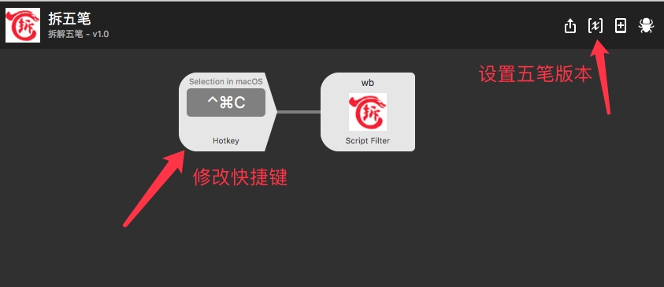

# 五笔 workflow

本 workflow 是从 http://www.chaiwubi.com/bmcx 获取拆字信息的，感谢www.chaiwubi.com 站点。

[下载](https://github.com/tianhao/alfred-wubi-workflow/raw/master/wubi.alfredworkflow)

效果图：

# 安装：

* 安装图片处理工具imagemagick： `brew install imagemagick`
* 安装本 workflow

# 使用:

* wb 汉字
* 快捷键(⌃+⌘+C) -> 汉字
* 选中汉字->按快捷键(⌃+⌘+C)

# 配置

默认为 98 版五笔，你可以通过下面方法设置以 86 版五笔，还可以设置快捷键

